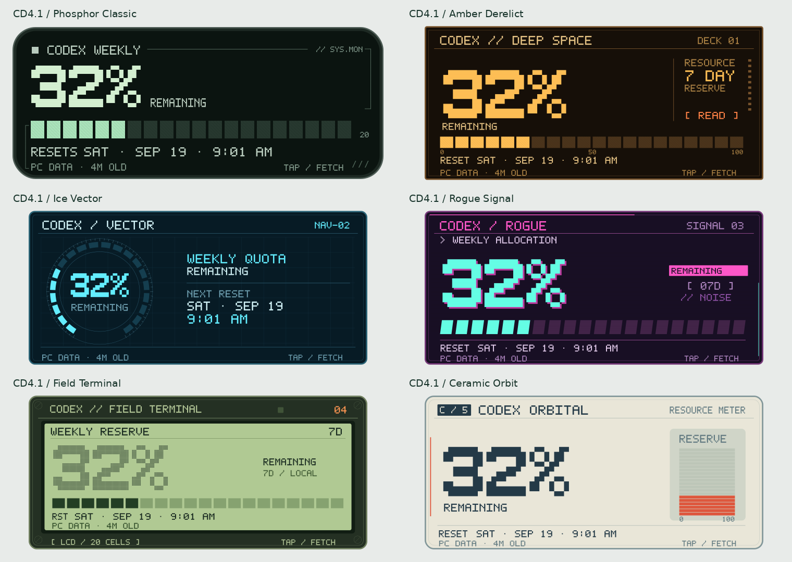

# Cyberdeck Status for KWGT

**Six pixel-style Android widgets for Codex quotas and other percentage-based feeds.**

## How I use it

**Codex tray on Windows → Tailscale → KWGT on Android.**

The tray exports the numbers, Tailscale shares them privately, and KWGT draws the widget. No Tasker, MacroDroid, or extra server. Codex credentials stay on the PC.

Inspired by **[Tooblippe's Codex Usage Tray](https://github.com/Tooblippe/codex-usage)**. The Windows changes live in **[my direct fork](https://github.com/arussin/codex-usage)**; this separate repository contains only widgets and original connector helpers. [Attribution](ATTRIBUTION.md).

## Set it up

**You need:** KWGT Pro and a status-feed URL. My setup also needs a Windows PC with signed-in Codex and Tailscale on both devices.

1. **Get your URL:** [Codex setup](docs/CODEX_SETUP.md) or [another data source](docs/CUSTOM_CONNECTORS.md).
2. **[Pick a theme](docs/THEMES.md)** and download its `.kwgt` file.
3. Add a KWGT home-screen widget, size its box, then import and load the theme.
4. Set **Globals → Source** to your URL and **Save**.

**Tap the body to refresh; tap the header to edit.** Below 10% changes the warning colors; a fresh 100% shows FULL. The footer shows the PC reading's age, not when you tapped. [Refresh help](docs/REFRESH.md).

**Downloads:** [all six widget themes](https://github.com/arussin/kwgt-cyberdeck-status/releases/tag/v0.1.0-preview.1) · [Windows tray with JSON export](https://github.com/arussin/codex-usage/releases/tag/v0.1.0-json-export-preview.2). Both are preview releases.

## Customization and future work

**Customization is limited in this preview.** Change the Source URL in KWGT. Pixel titles such as “CODEX WEEKLY” require the Python builder; field names, units and warning rules require source/formula edits. [Current options](docs/CUSTOMIZE.md).

Phone-editable titles, footer labels, warning thresholds and reset-display controls are future work. **[Contributions welcome](CONTRIBUTING.md#future-work-customization).**

[MIT license](LICENSE) · [Contributing](CONTRIBUTING.md)
